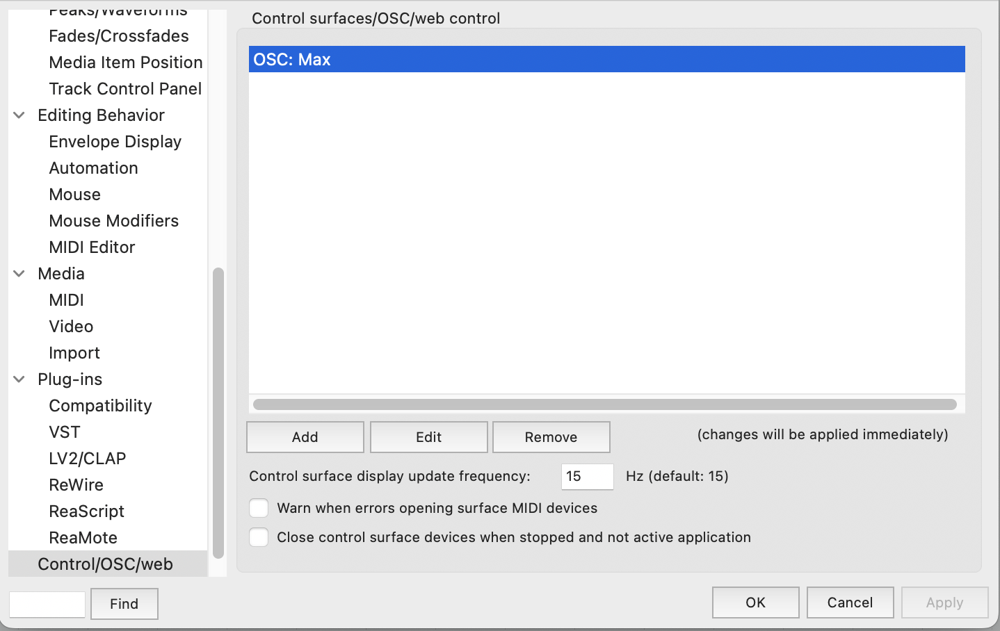
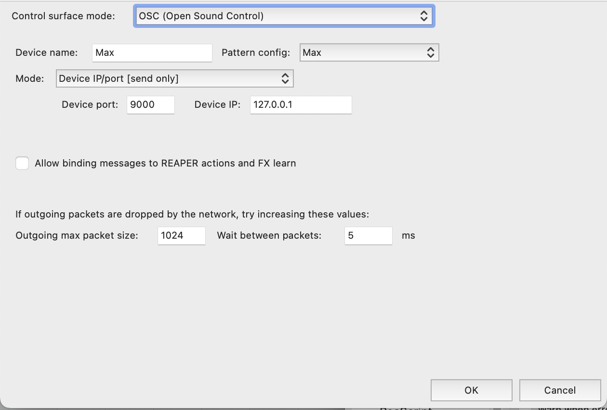

# Reaper Templates

Before trying any of the templates that involve sending OSC to Max, it is recommended to install the [dummy](./dummy) and [Max.ReaperOSC](./Max.ReaperOSC) files. To install, in Reaper, go to _Options>Show REAPER resource path in explorer/finder_. In the resource path folder, copy [dummy](./dummy) to Effects and [Max.ReaperOSC](./Max.ReaperOSC) to the OSC folder. For a video guide, [watch this short video](https://youtu.be/gHyjOB6yF1o) showing how to install these components.

File | What it does
---- | ------------
[dummy](https://github.com/brandflake11/ICAT-Documentation/blob/main/Reaper-Templates/dummy) | A reaper js plugin used for sending OSC coordinates to Max msp. This plugin allows for sending needed OSC data from Reaper to Max, after setting up OSC routings correctly in Reaper. To install, in Reaper, go to _Options>Show REAPER resource path in explorer/finder_ and copy to the _Effects_ folder. For more information on how to install the plugin, use [this video](https://youtu.be/9EegrN-gF5o). 
[Max.ReaperOSC](https://github.com/brandflake11/ICAT-Documentation/blob/main/Reaper-Templates/Max.ReaperOSC) | OSC settings for reaper for sending ambisonic coordinates to Max msp. To install, in Reaper, go to _Options>Show REAPER resource path in explorer/finder_ and copy to the OSC folder.

After installing/copying the two files, make sure to enable the OSC pattern config called Max in Reaper. In Reaper, go to _Options>Preferences>Control/OSC/Web_ and add an OSC control surface mode. Follow  and  and match your settings.

OSC Setting Name | Value
---------------- | -----
Control surface mode | OSC (Open Sound Control)
Device Name | Max
Pattern Config | Max
Mode | Device IP/port [send only]
Device Port | 9000
Device IP | 127.0.0.1
Allow binding messages to Reaper actions and FX learn | unchecked
Outgoing max packet size | 1024
Wait between packets | 5 ms

Below are the Reaper templates. Make sure to install the prerequisites from above and to keep in mind some of the templates require [Max patches](../max-patches).

Template | What it does
-------- | ------------
[CUBE_140TracksTemplate](https://github.com/brandflake11/ICAT-Documentation/blob/main/Reaper-Templates/CUBE_140TracksTemplate.RPP) | Routes 140 tracks to the Cube's 140 Loudspeakers, including the Subs and LFEs
[CUBE_64ChannelAmbisonicMixer](https://github.com/brandflake11/ICAT-Documentation/blob/main/Reaper-Templates/CUBE_64ChannelAmbisonicMixer.RPP) | Allows for automation of ICAT's Max msp ambisonic patch. This is not setup for audio, only osc automation for Max. 
[CUBE_64ChannelSpatialMixerTEMPLATE](https://github.com/brandflake11/ICAT-Documentation/blob/main/Reaper-Templates/CUBE_64ChannelSpatialMixerTEMPLATE.RPP) | 64 Channel Reaper output to Max msp ambisonic patch, with osc automation integrated. Use this if you want to send audio from Reaper to Max msp and automate it in Reaper for the Cube.
[PERFORM_64ChannelAmbisonicSend.RPP](https://github.com/brandflake11/ICAT-Documentation/blob/main/Reaper-Templates/PERFORM_64ChannelAmbisonicSend.RPP) | Allows or automation of ICAT's Max msp ambisonic patch. This is not setup for audio, only osc automation for Max.
[PERFORM_64ChannelAmbisonicSend+Soundflower.RPP](https://github.com/brandflake11/ICAT-Documentation/blob/main/Reaper-Templates/PERFORM_64ChannelAmbisonicSend%2BSoundflower.RPP) | Allows or automation of ICAT's Max msp ambisonic patch. This is not setup for audio, only osc automation for Max, including soundflower's output.
[PERFORM_64ChannelSpatialMixerTEMPLATE.RPP](https://github.com/brandflake11/ICAT-Documentation/blob/main/Reaper-Templates/PERFORM_64ChannelSpatialMixerTEMPLATE.RPP) | 64 Channel Reaper output to Max msp ambisonic patch, with osc automation integrated. Use this if you want to send audio from Reaper to Max msp and automate it in Reaper for Perform Studio.
[ambioBformatRecorder.RPP](https://github.com/brandflake11/ICAT-Documentation/blob/main/Reaper-Templates/ambioBformatRecorder.RPP) | Simple Reaper project to easily allow for recording of B-format audio. Gives you one four channel track with a B-format encoder plugin loaded.
[Tesseract Ambisonic Decoder.RPP](https://github.com/icatimmersive/ICAT-Documentation/blob/main/Reaper-Templates/Tesseract%20Ambisonic%20Decoder.RPP) | Ambisonic decoder Reaper template. Allows for decoding ambisonic mixes to the Tesseract. This template uses the ICST vst plugins for the decoding and Harpex-x trial for visualization. (Note: the Tesseract is portable and does move. The speaker layout might not be exactly the same.) If needed, the csv file of coordinates for the ICST plugins are [here](https://github.com/icatimmersive/ICAT-Documentation/blob/main/Reaper-Templates/tesseract-csv.csv).
[Perform Ambisonic Decoder.RPP](https://github.com/icatimmersive/ICAT-Documentation/blob/main/Reaper-Templates/Perform%20Ambisonic%20Decoder.RPP) | Ambisonic decoder Reaper template for ICAT's Perform Studio. This also uses the ICST vst plugins for decoding and Harpex-X trial for visualization. If needed, the csv file of coordinates for the ICST plugin is [here](https://github.com/icatimmersive/ICAT-Documentation/blob/main/Reaper-Templates/perform-icst-coordinates.csv).

